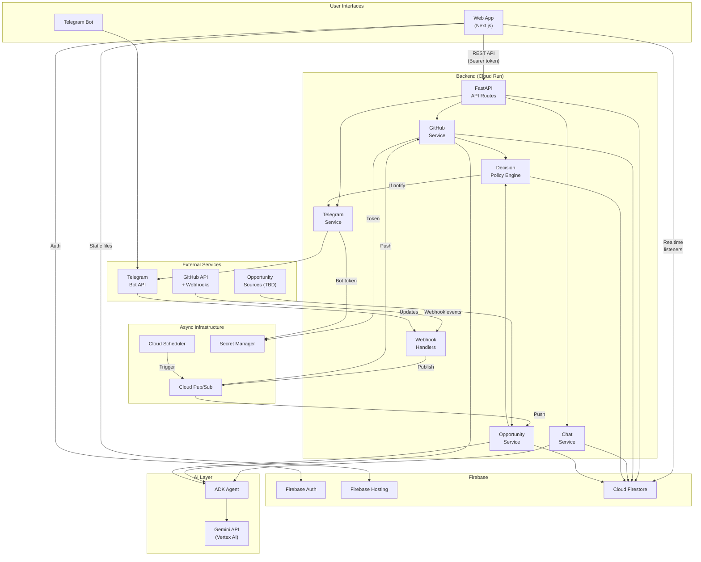
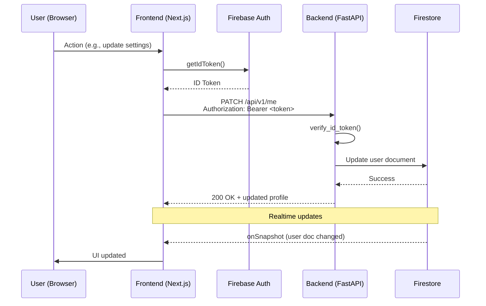
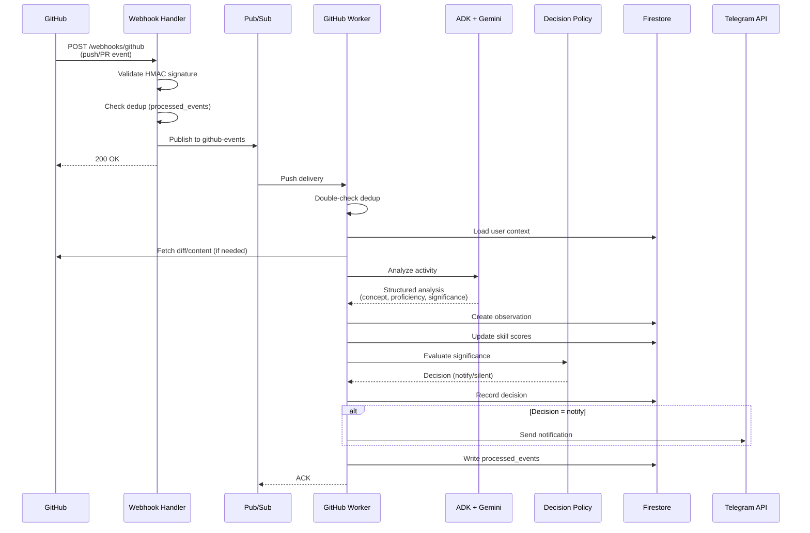
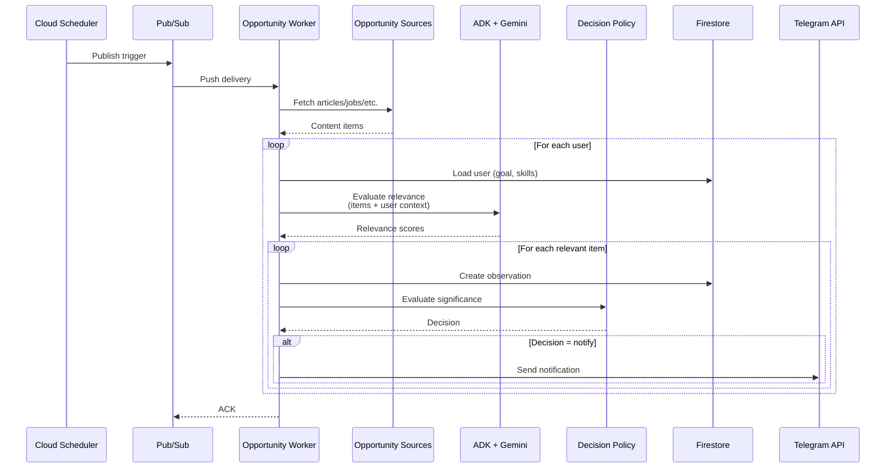
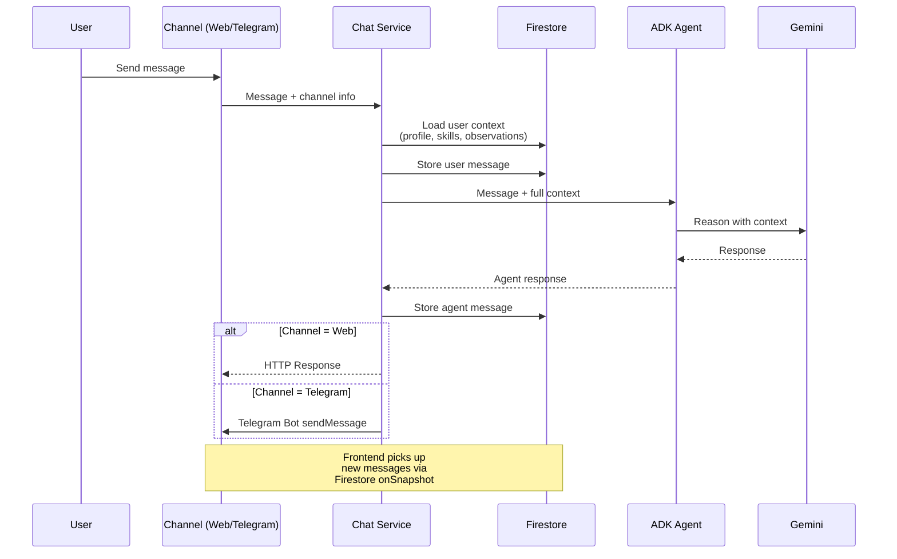
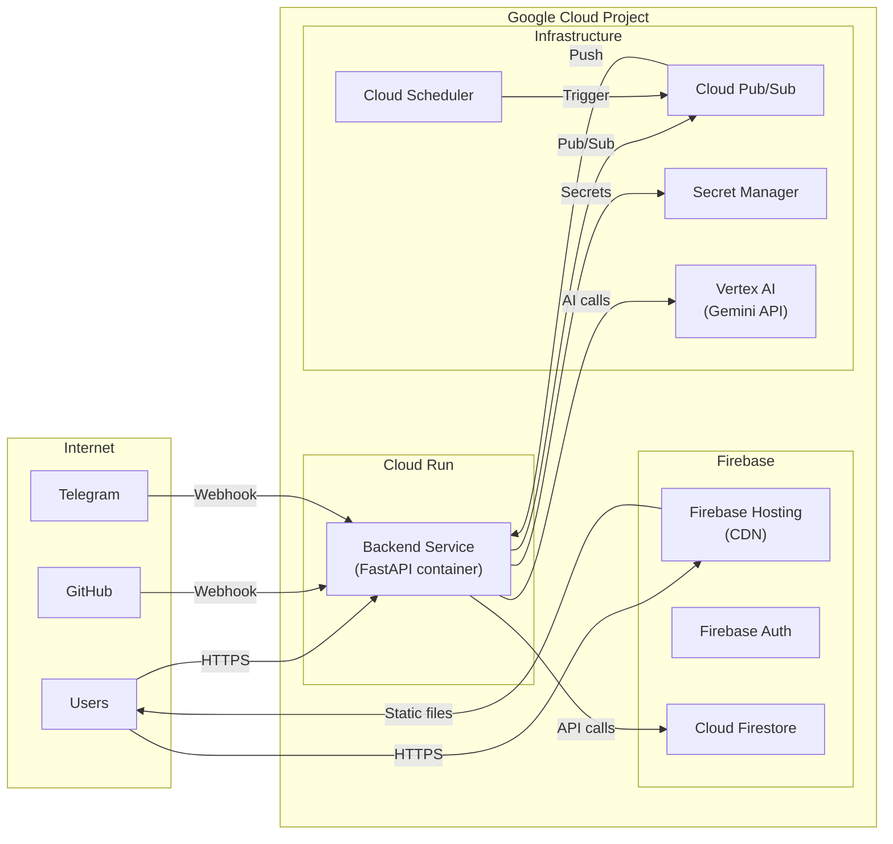

# Mark-I — Architecture Document

> **Status:** Draft v1.0  
> **Last updated:** 2026-08-19

---

## 1. System Architecture

---

## 2. Request Flow (Frontend → Backend)

---

## 3. GitHub Activity Flow

---

## 4. Opportunity Discovery Flow

---

## 5. Unified Chat Flow

---

## 6. Ownership Map

### Frontend Owns

| Area | Details |
|------|---------|
| **UI/UX** | All visual components, layouts, styling |
| **Firebase Auth (client)** | Sign-in flow, token management, provider setup |
| **Routing** | `/`, `/login`, `/onboarding`, `/dashboard`, `/chat`, `/settings` |
| **Dashboard** | Skill visualization, observation feed, decision log |
| **Chat Widget** | Chat UI, message display, input handling |
| **Settings UI** | Profile form, integration toggles, link code display |
| **Firestore Listeners** | Realtime subscriptions for user data |
| **GitHub OAuth Redirect** | Initiate OAuth flow, handle callback redirect |
| **Responsive Design** | Mobile/tablet/desktop layouts |

### Backend Owns

| Area | Details |
|------|---------|
| **Auth Verification** | Firebase ID token validation on every request |
| **All Firestore Writes** | User profiles, observations, messages, decisions |
| **Business Logic** | Decision policy, skill update formula, event processing |
| **AI/Agent** | ADK agent setup, Gemini calls, tool definitions, prompts |
| **GitHub Integration** | OAuth token exchange, webhook registration, API calls |
| **Telegram Integration** | Bot commands, message sending, webhook handling |
| **Webhook Processing** | GitHub event validation, Telegram update parsing |
| **Pub/Sub** | Topic management, message publishing, worker processing |
| **Secret Management** | Token storage/retrieval via Secret Manager |
| **Opportunity Collection** | Source fetching, relevance analysis, scheduling |
| **Decision Policy** | Significance evaluation, threshold logic, escalation rules |

### Shared Contract Points

| Contract | Location | Owner |
|----------|----------|-------|
| REST API | `openapi.yaml`, `docs/API.md` | Both (agreed upon) |
| Firestore Schema | `docs/FIRESTORE.md` | Both (agreed upon) |
| Firebase Auth Token Format | Firebase SDK standard | Firebase |
| GitHub OAuth Redirect URL | Agreed in setup | Both |

---

## 7. Deployment Architecture

---

## 8. Technology Stack Summary

| Layer | Technology | Purpose |
|-------|-----------|---------|
| Frontend Framework | Next.js 14+ | React-based web framework |
| Frontend Language | TypeScript | Type-safe frontend code |
| Frontend Auth | Firebase Auth (client SDK) | User authentication |
| Frontend Hosting | Firebase Hosting | Static file CDN |
| Frontend Realtime | Firestore (client SDK) | `onSnapshot` listeners |
| Backend Framework | FastAPI | Python REST API |
| Backend Language | Python 3.11+ | Backend implementation |
| Backend Runtime | Cloud Run | Managed container hosting |
| Database | Cloud Firestore | NoSQL document database |
| AI Framework | Google ADK | Agent orchestration |
| LLM | Gemini (Vertex AI) | Natural language understanding |
| Message Queue | Cloud Pub/Sub | Async event processing |
| Scheduler | Cloud Scheduler | Cron-like job scheduling |
| Secrets | Secret Manager | Secure credential storage |
| GitHub Auth | GitHub OAuth App | Repository access |
| Telegram | Telegram Bot API | User communication |
